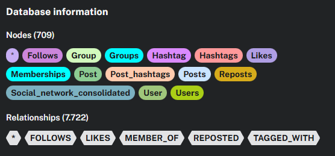

## Estrutura de nós e relacionamentos para Análise de Rede Social

## Arquivos .csv para criação dos dados mocados:

Efetuar a importação dos arquivos .csv para o Neo4j usando a ferramenta de importação do Neo4j.

Users: [text](users.csv)
Likes: [text](likes.csv)
Memberships: [text](memberships.csv)
Posts: [text](posts.csv)
Reposts: [text](reposts.csv)
Post_hashtags: [text](post_hashtags.csv)
Social_network_consolidated: [text](social_network_consolidated.csv)
Follows: [text](follows.csv)
Groups: [text](groups.csv)
Hashtags: [text](hashtags.csv)

## Arquivo com query para efetuar a criação dos relacionamentos:

[text](create_relationships.cypher) 

## Alguns exemplos de queries para análise de rede social:

### Retorna todos os usuários que seguem um usuário específico

MATCH (u:User {username: 'alice_1'})<-[:FOLLOWS]-(follower:User)
RETURN follower.username, follower.name, follower.followers_count
ORDER BY follower.followers_count DESC

### Retorna a quantidade de usuários que seguem um usuário específico

MATCH (u:User {username: 'alice_1'})<-[:FOLLOWS]-(follower:User)
RETURN COUNT(follower) as total_followers

### Postagem mais curtida no último mês

MATCH (p:Post)
WHERE p.createdAt > datetime().epochMillis - (30 * 24 * 60 * 60 * 1000)
RETURN p.id, p.content, p.likes_count, p.createdAt
ORDER BY p.likes_count DESC
LIMIT 1

### Caminho mais curto entre dois usuários

MATCH path = shortestPath(
  (u1:User {username: 'alice_1'})-[:FOLLOWS*]-(u2:User {username: 'bob_2'})
)
RETURN path, length(path) as degrees_of_separation

### Usuários mais influentes (por seguifores)

MATCH (u:User)
RETURN u.username, u.name, u.followers_count, u.posts_count
ORDER BY u.followers_count DESC
LIMIT 10

### Comunidades com mais membros

MATCH (g:Group)
RETURN g.name, g.description, g.members_count
ORDER BY g.members_count DESC
LIMIT 5

### Recomendação de usuários para seguir

MATCH (u:User {username: 'alice_1'})-[:FOLLOWS]->(followed:User)
MATCH (followed)-[:FOLLOWS]->(recommendation:User)
WHERE NOT (u)-[:FOLLOWS]->(recommendation)
AND u <> recommendation
RETURN recommendation.username, recommendation.name, COUNT(*) as mutual_follows
ORDER BY mutual_follows DESC
LIMIT 10

### Análise de engajamento de postagens

MATCH (u:User)-[:POSTED]->(p:Post)
RETURN u.username, 
       COUNT(p) as total_posts, 
       AVG(p.likes_count) as avg_likes,
       MAX(p.likes_count) as max_likes,
       SUM(p.likes_count) as total_likes
ORDER BY avg_likes DESC
LIMIT 10

### Hashtags mais populares

MATCH (h:Hashtag)
RETURN h.tag, h.usage_count
ORDER BY h.usage_count DESC
LIMIT 20

### Usuários que estão no mesmo grupo que um usuário específico

MATCH (u:User {username: 'alice_1'})-[:MEMBER_OF]->(g:Group)<-[:MEMBER_OF]-(other:User)
WHERE u <> other
RETURN other.username, other.name, g.name
ORDER BY g.name

### Usuários mais ativos

MATCH (u:User)-[:POSTED]->(p:Post)
RETURN u.username, u.name, COUNT(p) as post_count, u.followers_count
ORDER BY post_count DESC
LIMIT 10

### Postagens que foram mais compartilhadas

MATCH (p:Post)<-[:REPOSTED]-(u:User)
RETURN p.id, p.content, COUNT(u) as repost_count, p.likes_count
ORDER BY repost_count DESC
LIMIT 10

### Usuários com seguidores (novatos)

MATCH (u:User)
WHERE NOT (u)<-[:FOLLOWS]-()
RETURN u.username, u.name, u.createdAt
ORDER BY u.createdAt DESC
LIMIT 10

#### Postagens sem engajamento

MATCH (u:User)-[:POSTED]->(p:Post)
WHERE NOT (p)<-[:LIKES]-()
RETURN u.username, p.id, p.content, p.createdAt
ORDER BY p.createdAt DESC
LIMIT 10

### Análise de crescimento de seguidores

MATCH (u:User)
RETURN u.username, u.followers_count, u.createdAt
ORDER BY u.followers_count DESC
LIMIT 10

### Postagens mais comentadas

MATCH (u:User)-[:POSTED]->(p:Post)
RETURN u.username, p.id, p.content, p.comments_count, p.likes_count
ORDER BY p.comments_count DESC
LIMIT 10

### Usuários que seguem muitos mas tem poucos seguidores

MATCH (u:User)
RETURN u.username, u.name, u.following_count, u.followers_count,
       (u.following_count - u.followers_count) as follow_gap
ORDER BY follow_gap DESC
LIMIT 10

### Triângulos de amizada (grupos de 3 que se seguem mutuamente)

MATCH (u1:User)-[:FOLLOWS]->(u2:User)-[:FOLLOWS]->(u3:User)-[:FOLLOWS]->(u1)
RETURN u1.username, u2.username, u3.username
LIMIT 10

## Constrains e índices

### Foram criados constraints para garantir a unicidade de propriedades que devem ser únicas.

-- Constraints em User
CREATE CONSTRAINT user_id_unique FOR (u:User) REQUIRE u.id IS UNIQUE;
CREATE CONSTRAINT user_username_unique FOR (u:User) REQUIRE u.username IS UNIQUE;

-- Constraints em Post
CREATE CONSTRAINT post_id_unique FOR (p:Post) REQUIRE p.id IS UNIQUE;

-- Constraints em Group
CREATE CONSTRAINT group_id_unique FOR (g:Group) REQUIRE g.id IS UNIQUE;

-- Constraints em Hashtag
CREATE CONSTRAINT hashtag_id_unique FOR (h:Hashtag) REQUIRE h.id IS UNIQUE;
CREATE CONSTRAINT hashtag_tag_unique FOR (h:Hashtag) REQUIRE h.tag IS UNIQUE;

### 

-- Índices em User
CREATE INDEX user_username FOR (u:User) ON (u.username);
CREATE INDEX user_email FOR (u:User) ON (u.email);
CREATE INDEX user_created_at FOR (u:User) ON (u.createdAt);
CREATE INDEX user_followers FOR (u:User) ON (u.followers_count);

-- Índices em Post
CREATE INDEX post_created_at FOR (p:Post) ON (p.createdAt);
CREATE INDEX post_likes FOR (p:Post) ON (p.likes_count);
CREATE INDEX post_comments FOR (p:Post) ON (p.comments_count);

-- Índices em Group
CREATE INDEX group_name FOR (g:Group) ON (g.name);
CREATE INDEX group_members FOR (g:Group) ON (g.members_count);

-- Índices em Hashtag
CREATE INDEX hashtag_tag FOR (h:Hashtag) ON (h.tag);
CREATE INDEX hashtag_usage FOR (h:Hashtag) ON (h.usage_count);

### Foram criados índices compostos para otimizar queries que filtram por múltiplos campos.

CREATE INDEX user_created_followers FOR (u:User) ON (u.createdAt, u.followers_count);
CREATE INDEX post_created_likes FOR (p:Post) ON (p.createdAt, p.likes_count);

## Análise de performance com EXPLAIN e PROFILE

EXPLAIN
MATCH (u:User {username: 'alice_1'})<-[:FOLLOWS]-(follower:User)
RETURN follower.username, follower.followers_count
ORDER BY follower.followers_count DESC
LIMIT 10;

PROFILE
MATCH (u:User {username: 'alice_1'})<-[:FOLLOWS]-(follower:User)
RETURN follower.username, follower.followers_count
ORDER BY follower.followers_count DESC
LIMIT 10;

## Recursos utilizados

Foi utilizado o Manus para gerar dados mockados.

Foi utilizado o Neo4j Aura para criar o banco de dados e executar as queries.

